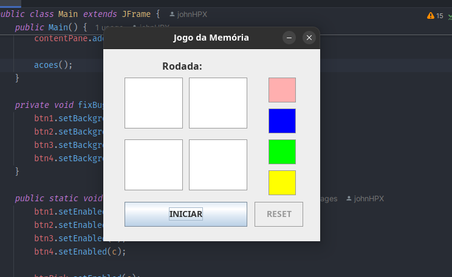
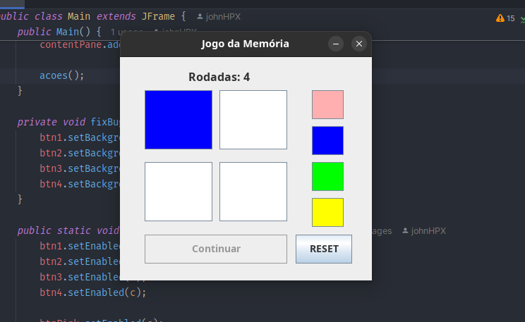
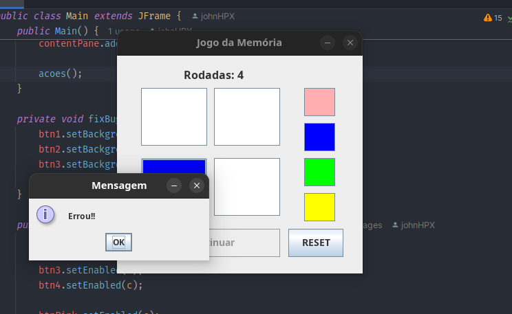

# Jogo da memória

## Contexto
Trabalho para compor a segunda nota da disciplina de Programação Orientada a Objetos 2. O trabalho envolve o uso de threads, o segundo assunto que aprendemos na disciplina. O objetivo é colocar em prática os conceitos da segunda parte do curso.

## PDF com as instruções

[📄 Visualizar o documento](https://drive.google.com/file/d/1H0AScvLOBQa1he3OOxHLXH0OozXW-N0M/view)

## Como foi feito
Usando a linguagem Java e sua poderososa orientação a objetos, mais a biblioteca do JDK para manipulação de threads e a biblioteca Swing.

## Minha opinião
<del>Quando terminar o trabalho, eu atualizo este tópico. </del>

Foi um pequeno desafio. Sem dúvidas, a maior dificuldade foi corrigir os bugs relacionados ao uso de threads. Basicamente, de vez em quando uma thread falhava e não atualizava o background do quadrante para a cor branca (WHITE), deixando a cor que havia sido sorteada. Isso não era o comportamento esperado para o jogo. O problema foi contornado com a criação do método fixBugBackgroundBtn(), um método simples, mas eficiente.

Essa experiência me proporcionou uma nova visão sobre como as threads podem ser utilizadas no mundo real e os desafios de sua implementação. No geral, gostei bastante deste trabalho/desafio, foi bem divertido! 😊

## Prints do Jogo

